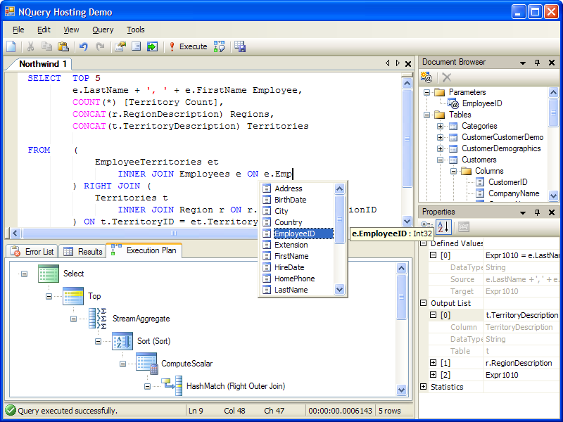

# Welcome to NQuery!

NQuery is a relational query engine written in C#. It allows you to execute a
`SELECT` query against .NET objects. It can use arrays, data sets, data tables
or any other custom table binding. NQuery is completely extensible so that you
can add custom functions, aggregates, constants and parameters.

In addition to the query engine itself this project also contains an integration
assembly with [Actipro's SyntaxEditor][2] so that you can author queries very
easily. This includes code completion, parameter info and syntax highlighting.

If you want to play around without reading the documentation you can download
the [demo application](http://nquery.codeplex.com/downloads/get/475130).

To see a list of the most important features see [Features](docs/Features.md).

For details how to use NQuery see the [Getting Started](docs/GettingStarted.md).

## Prerequisites

This section describes which dependencies [NQuery][1] has and how NQuery can be
built.

### Visual Studio Version

To build NQuery with Visual Studio you will at least need Visual C# 2008 Express
Edition. However, this only allows to build NQuery; some other features such as
unit testing are not supported in this version of Visual Studio.

* **Visual C# Express 2008 Express Edition** You cannot run unit tests, create
code coverage information or perform static code analysis.
	
* **Visual Studio 2008 Professional**. You cannot create code coverage
information or perform static code analysis.
	
* **Microsoft Visual Studio Team System 2008 Development Edition or higher** No
restrictions.

### Third Party Dependencies

If you only need to compile NQuery itself you don't neet any third party dlls.

#### Actipro

To build the editor integration you will need [Actipro Syntax Editor][2]. NQuery
provides an integration for version 4.0.

#### SandDock

To provide a modern look & feel the demo application uses the [SandDock][3]
docking library. NQuery itself does not require SandDock.

#### Sandcastle

The documentation is built using [Sandcastle][4]. In addition to Sandcastle
itself NQuery also relies on the [Sandcastle Style Patch][5] and
[Sandcastle Help File Builder (SHFB)][6]. If you don't want to create the
documentation you don't need these tools.

#### WiX

To build the setup you will need [Windows Installer XML (WiX)][7].

### Command Line Build

The `build.bat` in the build folder creates a full release build. Here, the term
'full' means that not only the project is compiled but also the demo
application, help file, and setup is generated. The Build folder contains
additional batch files running clean-, debug-, and compile-only-builds. All
batch files simply invoke MSBuild to run the Build.proj script.

The build artifacts are placed in the folder "Output".

Have fun!

[1]: http://nquery.codeplex.com
[2]: http://www.actiprosoftware.com/Products/DotNet/SyntaxEditor/Default.aspx
[3]: http://www.divil.co.uk/net/controls/sanddock/
[4]: http://sandcastle.codeplex.com
[5]: http://sandcastlestyles.codeplex.com
[6]: http://shfb.codeplex.com
[7]: http://wix.sourceforge.net